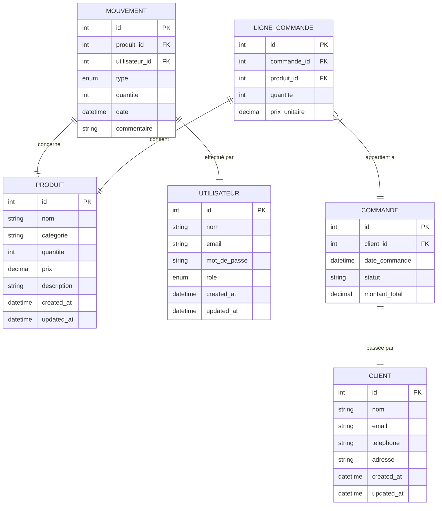

# Cahier des Charges - Application Web de Gestion de Stock
## Table des matières
1. [Introduction](#introduction)
2. [Architecture du Système](#architecture-du-système)
3. [Spécifications Techniques](#spécifications-techniques)
4. [Modèle de Données](#modèle-de-données)
5. [Diagramme Entité-Relation (ERD)](#diagramme-entité-relation-erd)
6. [Planning et Livrables](#planning-et-livrables)

## 1. Introduction
### 1.1 Contexte
- Application de gestion de stock basée sur une architecture microservices
- Remplacement d'une architecture monolithique existante
- Objectifs : scalabilité, modularité et résilience accrues

### 1.2 Objectif Principal
- Refactorisation en architecture microservices
- Stack technique : PHP/Symfony (Backend) et Angular (Frontend)

## 2. Architecture du Système
### 2.1 Services Principaux
1. **Service Utilisateur**
   - Authentification JWT
   - Gestion des rôles (admin, utilisateur)
   - CRUD utilisateurs

2. **Service Produit**
   - Gestion des produits
   - Gestion des catégories

3. **Service Client**
   - Gestion des informations clients

4. **Service Mouvement de Stock**
   - Suivi des entrées/sorties
   - Alertes de stock critique

5. **Service Rapports**
   - Génération de rapports
   - Visualisations graphiques

### 2.2 Fonctionnalités Principales
1. **Tableau de Bord**
   - Vue consolidée des données
   - Statistiques en temps réel
   - Alertes et notifications

2. **Gestion des Modules**
   - APIs REST/GraphQL
   - Opérations CRUD par module
   - Export de données (PDF/Excel)

## 3. Spécifications Techniques
### 3.1 Technologies
- **Backend** : PHP/Symfony
- **Frontend** : Angular
- **Base de données** : PostgreSQL/MySQL
- **API** : REST/GraphQL

### 3.2 Infrastructure
- **Conteneurisation** : Docker
- **Orchestration** : Kubernetes
- **API Gateway** : Kong/Traefik

### 3.3 Sécurité
- Authentification JWT
- Communications HTTPS
- Protection contre injections SQL et XSS

## 4. Modèle de Données
### 4.1 Structure des Tables

#### Service Produit
```sql
Table PRODUIT {
    id (PK)
    nom
    catégorie
    quantité
    prix
    description
    created_at
    updated_at
}
```

#### Service Client
```sql
Table CLIENT {
    id (PK)
    nom
    email
    téléphone
    adresse
    created_at
    updated_at
}
```

#### Service Utilisateur
```sql
Table UTILISATEUR {
    id (PK)
    nom
    email
    mot_de_passe
    rôle
    created_at
    updated_at
}
```

#### Service Mouvement de Stock
```sql
Table MOUVEMENT {
    id (PK)
    produit_id (FK)
    utilisateur_id (FK)
    type
    quantité
    date
    commentaire
}
```

#### Service Commande
```sql
Table COMMANDE {
    id (PK)
    client_id (FK)
    date_commande
    statut
    montant_total
}

Table LIGNE_COMMANDE {
    id (PK)
    commande_id (FK)
    produit_id (FK)
    quantité
    prix_unitaire
}
```

### 4.2 Relations entre Services
- Mouvement ↔ Produit (One-to-Many)
- Mouvement ↔ Utilisateur (One-to-Many)
- Commande ↔ Client (One-to-Many)
- LigneCommande ↔ Commande (One-to-Many)
- LigneCommande ↔ Produit (One-to-Many)

## 5. Diagramme Entité-Relation (ERD)


## 6. Planning et Livrables
### 6.1 Planning
1. Analyse des besoins : 2 semaines
2. Développement : 12 semaines
3. Tests et intégration : 4 semaines

### 6.2 Livrables
1. Microservices avec APIs
2. Interface Angular
3. Documentation technique
4. Tests validés
```

